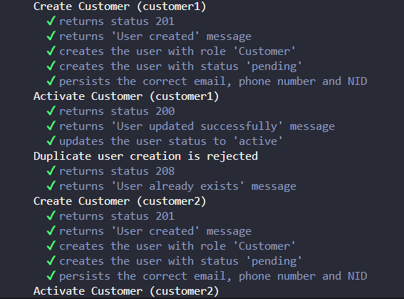
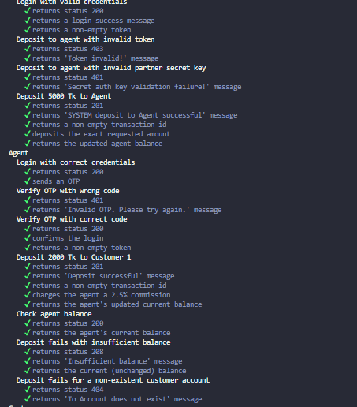
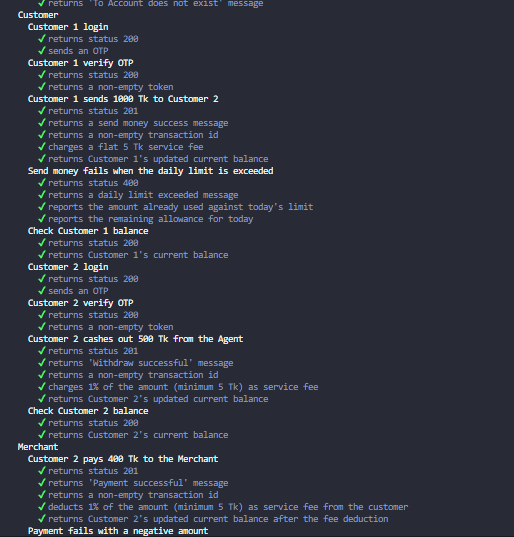
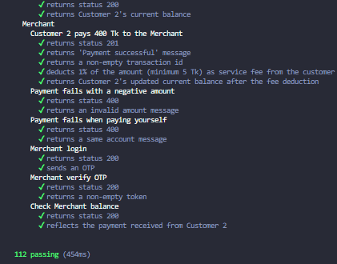

# dMoney API Integration Testing

Automated API integration testing for the **dMoney** application using **Mocha, Chai, Axios, and dotenv**.

The test suite covers authentication, user management, transaction flows, balance validation, fees, commissions, and API response assertions.

## Technology Stack

| Technology | Purpose |
|---|---|
| Node.js | JavaScript runtime |
| Mocha | Test runner |
| Chai | Assertions |
| Axios | API requests |
| dotenv | Environment variable management |

## Project Structure

```text
dMoney API Integration/
│
├── dmoney.spec.js
├── package.json
├── package-lock.json
├── .gitignore
├── README.md
│
└── Screenshot/
    ├── Integration_test_output.png
    ├── Integration_test_output1.png
    ├── Integration_test_output3.png
    └── npm_test_output.png
```

## Installation

### Prerequisites

- Node.js
- npm

### Install Dependencies

```bash
npm install
```

Or install the required packages individually:

```bash
npm install mocha chai axios dotenv
```

## Environment Setup

Create a `.env` file in the project root directory.

```env
BASE_URL=http://localhost:5000
PARTNER_KEY=ROADTOSDET
DEFAULT_OTP=0000

ADMIN_EMAIL=admin@dmoney.com
ADMIN_PASSWORD=1234

SYSTEM_EMAIL=system@dmoney.com
SYSTEM_PASSWORD=1234
```

> Keep the `.env` file private. Do not commit it to GitHub.

## Running the Tests

Run the complete test suite using:

```bash
npm test
```

## Test Flow

The test suite follows an end-to-end transaction flow:

```text
Admin Login
    ↓
Create Customer 1 → Activate
    ↓
Create Customer 2 → Activate
    ↓
Create Agent → Activate
    ↓
Create Merchant → Activate
    ↓
System Login
    ↓
System → Agent: Deposit 5,000 Tk
    ↓
Agent Login + OTP
    ↓
Agent → Customer 1: Deposit 2,000 Tk
    ↓
Customer 1 Login + OTP
    ↓
Customer 1 → Customer 2: Send 1,000 Tk
    ↓
Customer 2 Login + OTP
    ↓
Customer 2 → Agent: Cash Out 500 Tk
    ↓
Customer 2 → Merchant: Pay 400 Tk
    ↓
Merchant Balance Verification
```

## Authentication Flow

| User Type | Authentication |
|---|---|
| Admin | Email + Password |
| System | Email + Password |
| Customer | Login → OTP → Token |
| Agent | Login → OTP → Token |
| Merchant | Login → OTP → Token |

## Transaction Flow

| ## Transaction |  ## Amount |
|---|---:|
| System → Agent Deposit | 5,000 Tk |
| Agent → Customer Deposit | 2,000 Tk |
| Customer → Customer Send Money | 1,000 Tk |
| Customer Cash Out | 500 Tk |
| Customer → Merchant Payment | 400 Tk |

## Fee & Commission Validation

| Transaction | Rule | Expected |
|---|---|---:|
| Agent Deposit | 2.5% commission | 50 Tk |
| Send Money | Flat service fee | 5 Tk |
| Cash Out | 1%, minimum 5 Tk | 5 Tk |
| Merchant Payment | 1%, minimum 5 Tk | 5 Tk |


## Test Coverage

The test suite includes:

- User creation and activation
- Login and OTP verification
- Transaction processing
- Balance verification
- Fee and commission validation
- Daily transaction limit validation
- Negative and authentication scenarios
- HTTP response status assertions

## API Assertions

Each test case validates the expected HTTP response status.

Examples:

```javascript
expect(res.status).to.equal(200);
expect(res.status).to.equal(201);
expect(res.status).to.equal(400);
expect(res.status).to.equal(401);
expect(res.status).to.equal(403);
expect(res.status).to.equal(404);
expect(res.status).to.equal(208);
```

Response messages, transaction IDs, balances, fees, commissions, and other relevant response data are also validated where applicable.

## Test Result

Latest test execution:

```text
112 passing
0 failing
```

| Result | Count |
|---|---:|
| Passing | 112 |
| Failed | 0 |

## Test Execution Evidence

### Integration Test Output



### Integration Test Output



### Integration Test Output 1



### Integration Test Output 3



## Git Configuration

The following files are excluded from version control:

```gitignore
/node_modules
/.env
```
